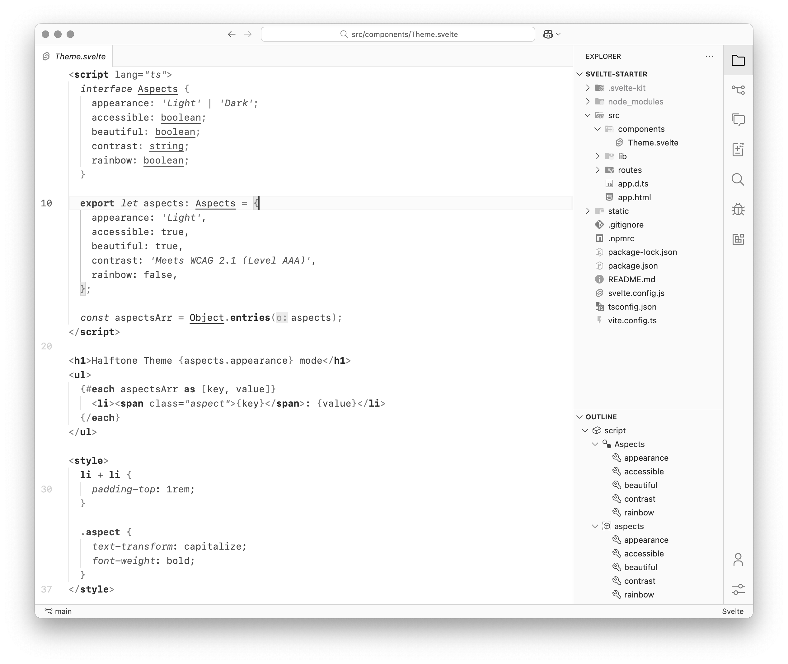
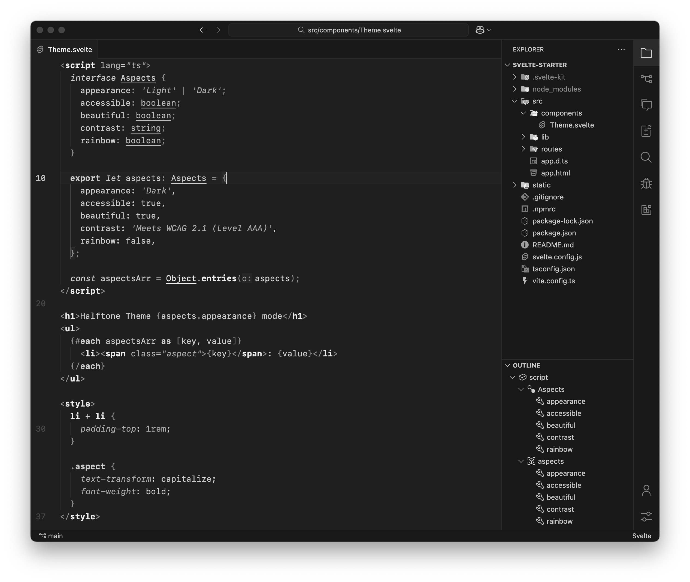

<h1 align="center">Halftone Theme</h1>
<p align="middle">
  
</p>
<p align="center" >
    Theme inspired by the monochrome halftone technique
</p>

## Syntax Highlighting is a zero-sum game
Halftone thoughtfully uses typographic emphasis, taking care to avoid overuse which can defeat the purpose by emphasizing too many elements.<br>
If everything is important, nothing is.

Halftone relies on underlines, bold and italic, because the human brain recognizes shape faster than color.<br>
Shape processing is also less complex and requires fewer brain resources, which can be useful for ADHD folks.

People with color vision impairments can sport this theme just like the rest of us, which I think is cool.

## Showcase
<p align="center">


<sub><samp>&nbsp;&nbsp;&nbsp;&nbsp;&nbsp;&nbsp;&nbsp;Font: <a href="https://developer.apple.com/fonts">SF Mono</a><br>
&nbsp;&nbsp;File Icons: <a href="https://marketplace.visualstudio.com/items?itemName=PKief.material-icon-theme">Material</a><br>
&nbsp;&nbsp;&nbsp;Product Icons: <a href="https://marketplace.visualstudio.com/items?itemName=antfu.icons-carbon">Carbon</a>&nbsp;&nbsp;&nbsp;&nbsp;&nbsp;&nbsp;<br>

## Match with System
```jsonc
// .vscode/setting.json
{
  "window.autoDetectColorScheme": true,
  "workbench.preferredLightColorTheme": "Halftone Light",
  "workbench.preferredDarkColorTheme": "Halftone Dark",
}
```

## Appendix
> When I was a child, I used to speak like a child, think like a child, reason like a child;
when I became a man, I did away with childish things.

> Syntax highlighting is juvenile.
When I was a child, I was taught arithmetic using colored rods.
I grew up and today I use monochromatic numerals.

<i>Rob Pike to a user requesting syntax highlighting in the Go Playground</i>
